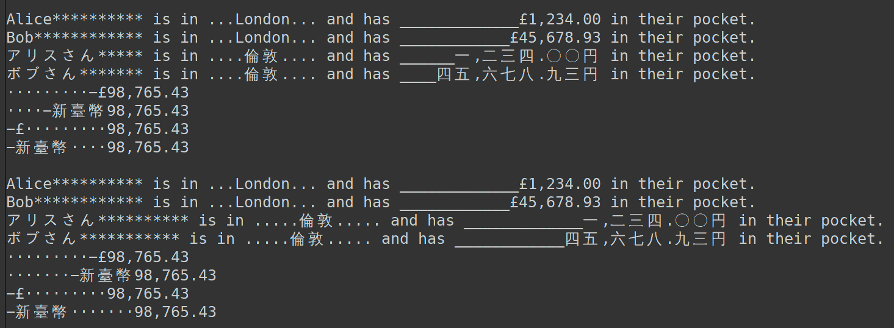

# EffString

<!-- START doctoc generated TOC please keep comment here to allow auto update -->
<!-- DON'T EDIT THIS SECTION, INSTEAD RE-RUN doctoc TO UPDATE -->
**Table of Contents**  *generated with [DocToc](https://github.com/thlorenz/doctoc)*

- [EffString](#effstring)
  - [Simple Example](#simple-example)
  - [API](#api)
  - [Format Specifier](#format-specifier)
    - [Format Specifier: Fill](#format-specifier-fill)
    - [Format Specifier: Align](#format-specifier-align)
    - [Format Specifier: Sign](#format-specifier-sign)
    - [Format Specifier: Symbol](#format-specifier-symbol)
    - [Format Specifier: Zeros](#format-specifier-zeros)
    - [Format Specifier: Width](#format-specifier-width)
    - [Format Specifier: Thousands](#format-specifier-thousands)
    - [Format Specifier: Precision](#format-specifier-precision)
    - [Format Specifier: Trailing](#format-specifier-trailing)
    - [Format Specifier: Type](#format-specifier-type)
    - [Format Specifier: SI Unit Prefix](#format-specifier-si-unit-prefix)
  - [Locale Settings](#locale-settings)
  - [Pre-Defined Locales](#pre-defined-locales)
  - [Handling of 'Wide' Characters](#handling-of-wide-characters)
  - [Demo](#demo)
  - [Required NodeJS Version](#required-nodejs-version)
  - [To Do](#to-do)
  - [Is Done](#is-done)
  - [Don't](#dont)

<!-- END doctoc generated TOC please keep comment here to allow auto update -->


# EffString

EffString re-packages the great [d3-format](https://d3js.org/d3-format) library to provide formatting for
numerical values in JavaScript [tagged
templates](https://developer.mozilla.org/en-US/docs/Web/JavaScript/Reference/Template_literals#tagged_templates).

Using EffString is simple: to get formatting for the default locale `en-US`, simply import the tag function
`f` and put it in front of a JavaScript template literal; then, after each interpolated value field of the
string, you can put a [format specifier](#format-specifier) that is delineated by a leading colon `:` and a
trailing semicolon `;`.

For other [pre-defined locales]()

## Simple Example

JavaScript:

```js
const { f, } = require( 'effstring' );
console.log( f`${'Alice'}:*<15c; has ${1234}:_>$12,.00f; in their pocket.`   );
console.log( f`${'Bob'}:*<15c; has ${45678.93}:_>$12,.00f; in their pocket.` );
```

CoffeeScript:

```coffee
{ f, } = require 'effstring'
console.log f"#{'Alice'}:*<15c; has #{1234}:_>$12,.00f; in their pocket."
console.log f"#{'Bob'}:*<15c; has #{45678.93}:_>$12,.00f; in their pocket."
```

Result:

```
Alice********** has ___$1,234.00 in their pocket.
Bob************ has __$45,678.93 in their pocket.
┌──────────────     ┌───────────
│                   │ 12 characters right aligned
│                   │ filled with underscores
│                   │ currency, 2 decimals
│                   │ thousands separator
│
│ 20 characters left aligned
│ filled with asterisks
```

## API

Calling `require 'effstring'` will return an object with these public members:

*  **`f""`**: The default tag function (formatter) which assumes an `en-US` locale.
*  **`new_ftag()`**: Method to create a new tag function with [custom locale settings](#locale-settings).
*  **`Effstring_error`**: Abstract base class for errors thrown by `effstring`; actual errors will be either
   `Effstring_syntax_error`, `Effstring_lib_syntax_error`, `Effstring_syntax_fillwidth_error`, or
   `Effstring_validation_error` (also exported).

The following are also exported but only meant for internal use such as testing:
*  **`_d3_format`**: The underlying `d3-format` library that does the heavy lifting.
*  **`_default_locale`**: The [default locale](#locale-settings).
*  **`_hint_as_locale_cfg()`**: Given either an object or a BCP47 locale code such as `en-GB` or `ja-JP`,
   return an object with the locale settings.
*  **`_locale_cfg_from_bcp47()`**: Given a BCP47 locale code such as `en-GB` or `ja-JP`,
   return an object with the locale settings.
*  **`_locale_cfg_from_hints()`**: Given a sequence of locale hints (BCP47 codes or objects), resolve to a
   complete locale settings object with defaults filled out; settings coming later will overwriter ones that
   come earlier (using `Object.assign()`).
*  **`_fmtspec_re`**: The regular expression used to spot the optional format specifier that may follow an
   EffString interpolated field.

## Format Specifier

The general shape of a string literal with an EffString tag function and an interpolated value field
is shown below.

```

f`${x}:[[fill]align][sign][symbol][zeros][width][thousands][.precision][~][type][/unit];` (JS)
f"#{x}:[[fill]align][sign][symbol][zeros][width][thousands][.precision][~][type][/unit];" (CoffeeScript)
         ┌─── ┌────  ┌───  ┌───── ┌───── ┌───── ┌───────── ┌────────── ┌─ ┌────  ┌────
         │    │      │     │      │      │      │          │           │  │      │
         │ ¤  │ <    │ ␣   │ $    │ 0    │ ℕ    │ ,        │ .ℕ        │~ │ e    │ /y
              │ ^    │ +   │ #                                            │ f    │ /z
              │ >    │ -                                                  │ g    │ /a
              │ =    │ (                                                  │ r    │ /f
                                                                          │ s    │ /p
                                                                          │ %    │ /n
* Symbols:                                                                │ p    │ /µ
   ¤: any single-width Unicode BMP character                              │ b    │ /m
   ␣: U+0020, space character                                             │ o    │ /1
   ℕ: /[1-9][0-9]*/, an integer number                                    │ d    │ /k
* other characters represent themselves;                                  │ x    │ /M
* all fields are optional;                                                │ X    │ /G
* a leading  fill chr must always be followed by an alignment specifier   │ c    │ /T
                                                                                 │ /P
                                                                                 │ /E
                                                                                 │ /Z
                                                                                 │ /Y
```


### Format Specifier: Fill

The optional fill specifier, when present, must be a single-width character from the Unicode Basic
Multilingual Plane (BMP); this includes code points between U+0000 thru U+ffff with the exception of CJK
Ideographs (Hanzi, Kanji, Hanja) and any other fullwidth characters. When present, the fill character must
always be followed by one of the alignment specifiers `<`, `^`, `>`, or `=`; thus, even characters like `;`
and `<` are allowed fill specifiers as in `:;>10;` (fill `;`, alignment `>`, width `10`) and `:<>10;` (fill
`<`, alignment `>`, width `10`).


### Format Specifier: Align

* **`>`**: right-aligned (default)
* **`<`**: left-aligned
* **`^`**: centered
* **`=`**: right-aligned but with any sign and symbol to the *left* of any padding

### Format Specifier: Sign

* **`-`**: positive numbers get nothing, negatives ones get a minus sign (default)
* **`+`**: positive numbers get a plus sign, negative ones get a minus sign
* **`(`**: positive numbers get nothing, negatives ones get parentheses
* **`␣`** (space) positive numbers get a space, negative numbers a minus sign


### Format Specifier: Symbol

* **`$`**: apply currency symbols per the locale definition
* **`#`**: for binary, octal, or hexadecimal notation, prefix by `0b`, `0o`, or `0x`, respectively.


### Format Specifier: Zeros

The `zeros` option is indicated by a digit zero **`0`** right *before* the digits of the width field and
enables zero-padding (this implicitly sets `fill` to `0` and `align` to `=`).


### Format Specifier: Width

The `width` defines the minimum field width; if not specified, then the width will be determined by the
content.


### Format Specifier: Thousands

The `thousands` option (activated by the presence of a comma **`,`** right *behind* the digits indicating
the width) enables the use of a group separator, such as a comma for thousands.


### Format Specifier: Precision

Depending on the value of the `type` specifier, the `precision` specifier either indicates the number of
digits that follow the decimal point (types `f` and `%`), or the number of significant digits (types `e`,
`g`, `r`, `s` and `p`). If the precision is not specified, it defaults to 6 for all types except for the
default type specifier, for which a precision of 12 is assumed.

Precision is ignored for integer formats (types `b`, `o`, `d`, `x`, and `X`) and character data (type `c`).

<!-- See [precisionFixed](https://d3js.org/d3-format#precisionFixed) and -->
<!-- [precisionRound](https://d3js.org/d3-format#precisionRound) for help picking an appropriate precision. -->

### Format Specifier: Trailing

The `trailing` option is activated by a tilde **`~`** right in front of the `type` specifier. This is most
commonly used in conjunction with types `r`, `e`, `s` and `%`. Its effect is to trim insignificant trailing
zeros.

### Format Specifier: Type

The available type specifiers are:

* **`e`**: exponent notation
* **`f`**: fixed point notation
* **`g`**: either decimal or exponent notation, rounded to significant digits
* **`r`**: decimal notation, rounded to significant digits
* **`s`**: decimal notation with an [SI prefix](https://d3js.org/d3-format#locale_formatPrefix), rounded to significant digits
* **`n`**: shorthand for `,g`, that is, decimal or exponent notation with group separators
* **`%`**: multiply by 100, and then decimal notation with a percent sign
* **`p`**: multiply by 100, round to significant digits, and then decimal notation with a percent sign
* **`b`**: binary notation, rounded to integer
* **`o`**: octal notation, rounded to integer
* **`d`**: decimal notation, rounded to integer
* **`x`**: hexadecimal notation, using lower-case letters, rounded to integer
* **`X`**: hexadecimal notation, using upper-case letters, rounded to integer
* **`c`**: character data, for a string of text

Leaving out the type specifier is treated as shorthand for `~g` (with a default precision of 12 instead of
6). For the `g`, `n` and default types, decimal notation is used if the resulting string would have up to
the number of digits indicated by the precision specifier; otherwise, exponent notation is used.

### Format Specifier: SI Unit Prefix

* **`y`**: yocto, 10⁻²⁴
* **`z`**: zepto, 10⁻²¹
* **`a`**: atto, 10⁻¹⁸
* **`f`**: femto, 10⁻¹⁵
* **`p`**: pico, 10⁻¹²
* **`n`**: nano, 10⁻⁹
* **`µ`**: micro, 10⁻⁶
* **`m`**: milli, 10⁻³
* **`1`**: unit, 10⁰
* **`k`**: kilo, 10³
* **`M`**: mega, 10⁶
* **`G`**: giga, 10⁹
* **`T`**: tera, 10¹²
* **`P`**: peta, 10¹⁵
* **`E`**: exa, 10¹⁸
* **`Z`**: zetta, 10²¹
* **`Y`**: yotta, 10²⁴

## Locale Settings

```coffee
_default_locale =
  decimal:    '.'                                                   # decimal point
  thousands:  ','                                                   # group separator
  grouping:   [ 3, ]                                                # array of group sizes, cycled as needed
  currency:   [ '$', '', ]                                          # currency prefix and suffix
  numerals:   [ '0', '1', '2', '3', '4', '5', '6', '7', '8', '9', ] # array of ten strings to replace digits 0-9
  percent:    '%'                                                   # percent sign
  minus:      '−' # U+2212                                          # minus sign
  nan:        'NaN'                                                 # not-a-number value
  fullwidth:  true                                                  # may switch off fullwidth support
```

## Pre-Defined Locales

For the following locales, `d3-format` provides ready-made settings:

|   Code   |                                    Description                                    |
|----------|-----------------------------------------------------------------------------------|
| `ar-001` | Arabic — World (global standard Arabic; "Modern Standard Arabic" typically used)  |
| `ar-AE`  | Arabic — United Arab Emirates (Gulf Arabic dialect)                               |
| `ar-BH`  | Arabic — Bahrain (Gulf Arabic dialect, Bahraini variant)                          |
| `ar-DJ`  | Arabic — Djibouti (East African Arabic)                                           |
| `ar-DZ`  | Arabic — Algeria (Maghrebi Arabic)                                                |
| `ar-EG`  | Arabic — Egypt (Egyptian Arabic, a widely influential dialect)                    |
| `ar-EH`  | Arabic — Western Sahara (Hassaniya Arabic, Maghrebi influence)                    |
| `ar-ER`  | Arabic — Eritrea (official language, used in government and some communities)     |
| `ar-IL`  | Arabic — Israel (Arabic spoken by Arab citizens of Israel)                        |
| `ar-IQ`  | Arabic — Iraq (Mesopotamian Arabic dialects)                                      |
| `ar-JO`  | Arabic — Jordan (Levantine Arabic)                                                |
| `ar-KM`  | Arabic — Comoros (formal/official language; Comorian Arabic influence)            |
| `ar-KW`  | Arabic — Kuwait (Gulf Arabic dialect)                                             |
| `ar-LB`  | Arabic — Lebanon (Levantine Arabic)                                               |
| `ar-LY`  | Arabic — Libya (Maghrebi Arabic)                                                  |
| `ar-MA`  | Arabic — Morocco (Maghrebi Arabic, Darija)                                        |
| `ar-MR`  | Arabic — Mauritania (Hassaniya Arabic)                                            |
| `ar-OM`  | Arabic — Oman (Gulf Arabic, with some unique Omani dialects)                      |
| `ar-PS`  | Arabic — Palestine (Levantine Arabic)                                             |
| `ar-QA`  | Arabic — Qatar (Gulf Arabic)                                                      |
| `ar-SA`  | Arabic — Saudi Arabia (Najdi, Hejazi, and Gulf Arabic variants)                   |
| `ar-SD`  | Arabic — Sudan (Sudanese Arabic)                                                  |
| `ar-SO`  | Arabic — Somalia (secondary language, limited usage)                              |
| `ar-SS`  | Arabic — South Sudan (minority usage; Arabic-based "Juba Arabic" in some regions) |
| `ar-SY`  | Arabic — Syria (Levantine Arabic)                                                 |
| `ar-TD`  | Arabic — Chad (Chadian Arabic, lingua franca)                                     |
| `ar-TN`  | Arabic — Tunisia (Tunisian Arabic, Maghrebi influence)                            |
| `ar-YE`  | Arabic — Yemen (Yemeni Arabic, with multiple regional dialects)                   |
| `ca-ES`  | Catalan — Spain (Catalonia, Valencia, Balearic Islands)                           |
| `cs-CZ`  | Czech — Czech Republic                                                            |
| `da-DK`  | Danish — Denmark                                                                  |
| `de-CH`  | German — Switzerland (Swiss Standard German)                                      |
| `de-DE`  | German — Germany (Standard German)                                                |
| `en-CA`  | English — Canada                                                                  |
| `en-GB`  | English — United Kingdom                                                          |
| `en-IE`  | English — Ireland                                                                 |
| `en-IN`  | English — India (Indian English variant)                                          |
| `en-US`  | English — United States                                                           |
| `es-BO`  | Spanish — Bolivia                                                                 |
| `es-ES`  | Spanish — Spain (Castilian Spanish)                                               |
| `es-MX`  | Spanish — Mexico                                                                  |
| `fi-FI`  | Finnish — Finland                                                                 |
| `fr-CA`  | French — Canada (mainly Québec French)                                            |
| `fr-FR`  | French — France (Standard French)                                                 |
| `he-IL`  | Hebrew — Israel                                                                   |
| `hu-HU`  | Hungarian — Hungary                                                               |
| `it-IT`  | Italian — Italy                                                                   |
| `ja-JP`  | Japanese — Japan                                                                  |
| `ko-KR`  | Korean — South Korea                                                              |
| `mk-MK`  | Macedonian — North Macedonia                                                      |
| `nl-NL`  | Dutch — Netherlands                                                               |
| `pl-PL`  | Polish — Poland                                                                   |
| `pt-BR`  | Portuguese — Brazil                                                               |
| `pt-PT`  | Portuguese — Portugal                                                             |
| `ru-RU`  | Russian — Russia                                                                  |
| `sl-SI`  | Slovenian — Slovenia                                                              |
| `sv-SE`  | Swedish — Sweden                                                                  |
| `uk-UA`  | Ukrainian — Ukraine                                                               |
| `zh-CN`  | Chinese (Simplified) — Mainland China                                             |

## Handling of 'Wide' Characters

EffString makes an effort to correctly handle so-called ['wide' or (Asian) 'fullwidth'
characters](https://en.wikipedia.org/wiki/Halfwidth_and_fullwidth_forms) (`d3-format` per se lacks that
capability). As the below proof-of-concept demonstrates, it's possible to mix CJK Kanji and Kana with
'normal width' / 'halfwidth' characters and get adjusted fieldwidths (upper two blocks). In order to skip
fullwidth processing, pass in `{ fullwidth: false, }` to `new_ftag()` (lower two blocks):

```coffee
{ new_ftag, } = require 'effstring'

do =>
  ja_jp_cfg     = {
    numerals: [ '〇', '一', '二', '三', '四', '五', '六', '七', '八', '九', ], }
  f_en = new_ftag 'en-GB'
  f_ja = new_ftag 'ja-JP', ja_jp_cfg
  console.log f_en"#{'Alice'}:*<15c; is in #{'London'}:.^12c; and has #{1234}:_>$22,.2f; in their pocket."
  console.log f_en"#{'Bob'}:*<15c; is in #{'London'}:.^12c; and has #{45678.93}:_>$22,.2f; in their pocket."
  console.log f_ja"#{'アリスさん'}:*<15c; is in #{'倫敦'}:.^12c; and has #{1234}:_>$22,.2f; in their pocket."
  console.log f_ja"#{'ボブさん'}:*<15c; is in #{'倫敦'}:.^12c; and has #{45678.93}:_>$22,.2f; in their pocket."

do =>
  zh_tw_cfg     =
    currency: [ '新臺幣', '', ],
  f_en = new_ftag 'en-GB'
  f_zh = new_ftag 'zh-CN', zh_tw_cfg
  console.log f_en"#{-98765.43}:·>$20,.2f;"
  console.log f_zh"#{-98765.43}:·>$20,.2f;"
  console.log f_en"#{-98765.43}:·=$20,.2f;"
  console.log f_zh"#{-98765.43}:·=$20,.2f;"

do =>
  ja_jp_cfg     = {
    numerals: [ '〇', '一', '二', '三', '四', '五', '六', '七', '八', '九', ], }
  f_en = new_ftag 'en-GB',            { fullwidth: false, }
  f_ja = new_ftag 'ja-JP', ja_jp_cfg, { fullwidth: false, }
  console.log f_en"#{'Alice'}:*<15c; is in #{'London'}:.^12c; and has #{1234}:_>$22,.2f; in their pocket."
  console.log f_en"#{'Bob'}:*<15c; is in #{'London'}:.^12c; and has #{45678.93}:_>$22,.2f; in their pocket."
  console.log f_ja"#{'アリスさん'}:*<15c; is in #{'倫敦'}:.^12c; and has #{1234}:_>$22,.2f; in their pocket."
  console.log f_ja"#{'ボブさん'}:*<15c; is in #{'倫敦'}:.^12c; and has #{45678.93}:_>$22,.2f; in their pocket."

do =>
  zh_tw_cfg     = {
    currency: [ '新臺幣', '', ],
    # numerals: [ '〇', '一', '二', '三', '四', '五', '六', '七', '八', '九', ],
    }
  f_en = new_ftag 'en-GB',            { fullwidth: false, }
  f_zh = new_ftag 'zh-CN', zh_tw_cfg, { fullwidth: false, }
  console.log f_en"#{-98765.43}:·>$20,.2f;"
  console.log f_zh"#{-98765.43}:·>$20,.2f;"
  console.log f_en"#{-98765.43}:·=$20,.2f;"
  console.log f_zh"#{-98765.43}:·=$20,.2f;"
```

This will produce neatly adjusted fields even if it doesn't quite show here which is down to GitHub's choice
of fonts:

```
Alice********** is in ...London... and has _____________£1,234.00 in their pocket.
Bob************ is in ...London... and has ____________£45,678.93 in their pocket.
アリスさん***** is in ....倫敦.... and has ______一,二三四.〇〇円 in their pocket.
ボブさん******* is in ....倫敦.... and has ____四五,六七八.九三円 in their pocket.
·········−£98,765.43
····−新臺幣98,765.43
−£·········98,765.43
−新臺幣····98,765.43

Alice********** is in ...London... and has _____________£1,234.00 in their pocket.
Bob************ is in ...London... and has ____________£45,678.93 in their pocket.
アリスさん********** is in .....倫敦..... and has _____________一,二三四.〇〇円 in their pocket.
ボブさん*********** is in .....倫敦..... and has ____________四五,六七八.九三円 in their pocket.
·········−£98,765.43
·······−新臺幣98,765.43
−£·········98,765.43
−新臺幣·······98,765.43
```

It looks more better in the terminal which is the primary use case for handling fullwidth anyway; notice how
in the upper two blocks everything lines up nicely whereas it doesn't in the lower two blocks which have
`fullwidth` set to `false`:




## Demo


| Input                        | Output                      | Notes                                         |
| ---                          | :---------                  | :----------                                   |
| `f''`                        | `''`                        | empty string remains empty string. Yay!       |
| `f'helo'`                    | `'helo'`                    | any string without interpolation...           |
| `f'(#{123})'`                | `'(#{123})'`                | ...just remains as-is                         |
| `f"(#{123})"`                | `'(123)'`                   |                                               |
| `f"(#{123}:5;)"`             | `'(  123)'`                 |                                               |
| `f"(#{123}:>5;)"`            | `'(  123)'`                 |                                               |
| `f"(#{123}:<5;)"`            | `'(123  )'`                 |                                               |
| `f"(#{123.456}:>5.2;)"`      | `'(1.2e+2)'`                |                                               |
| `f"(#{123.456}:>5.2f;)"`     | `'(123.46)'`                |                                               |
| `f"(#{123.456}:>15.2f;)"`    | `'(         123.46)'`       |                                               |
| `f"(#{1234.567}:>15.2f;)"`   | `'(        1234.57)'`       |                                               |
| `f"(#{1234.567}:=>15.2f;)"`  | `'(========1234.57)'`       |                                               |
| `f"(#{1234.567}:=>15,.2f;)"` | `'(=======1,234.57)'`       |                                               |
| `f"(#{123.456}:<15.2f;)"`    | `'(123.46         )'`       |                                               |
| `f"(#{1234.567}:<15.2f;)"`   | `'(1234.57        )'`       |                                               |
| `f"(#{1234.567}:=<15.2f;)"`  | `'(1234.57========)'`       |                                               |
| `f"(#{1234.567}:=<15,.2f;)"` | `'(1,234.57=======)'`       |                                               |
| `f"#{0.123}:.0%;"`           | `'12%'`                     | rounded percentage                            |
| `f"#{-3.5}:($.2f;"`          | `'($3.50)'`                 | localized fixed-point currency                |
| `f"#{-3.5}:($.2f;"`          | `'(£3.50)'`                 | localized fixed-point currency                |
| `f"#{42}:+20;"`              | `'                 +42'`    | space-filled and signed                       |
| `f"#{42}:.^20;"`             | `'.........42.........'`    | dot-filled and centered                       |
| `f"#{42e6}:.2s;"`            | `'42M'`                     | SI-prefix with two significant digits         |
| `f"#{48879}:#x;"`            | `'0xbeef'`                  | prefixed lowercase hexadecimal                |
| `f"#{4223}:,.2r;"`           | `'4,200'`                   | grouped thousands with two significant digits |

| Input           | Error                       | Notes       |
| ---             | :---------                  | :---------- |
| `f"(#{123}:)"`  | `illegal format expression` |             |
| `f"(#{123}:;)"` | `illegal format expression` |             |


## Required NodeJS Version

EffString relies on [`sindresorhus/string-width`](https://github.com/sindresorhus/string-width) to adjust
strings with fullwidth characters; since `string-width` is an ESM module but EffString uses CJS'
`require()`, EffString needs at least NodeJS v22 (with `--experimental-require-module` command line flag) or
v23 (without command line flag).

## To Do

* **`[—]`** cache intermediate values when handling fullwidth characters
* **`[—]`** allow to configure plus sign
* **`[—]`** in format specifier, make format `type` field mandatory and delete the passage above about it
  being "treated as shorthand for `~g` (with a default precision of 12 instead of 6)" because no user is
  ever going to grok and use it, and they have no reason to; they can still use `:.12~g;` if it's that what
  they want
* **`[—]`** consider to make other format specifier fields mandatory like the `type` field

## Is Done

* **`[+]`** basic handling of fullwidth characters
* **`[+]`** use `D3F.formatPrefix()` to implement units format type specifier as in
  `f"#{0.00042}:_<15,.3/µ;"`
  * **`[+]`** may want to use `:...f/#{unit};` as in `f"#{0.00042}:_<15,.3f/µ;"`; that way users are
    reminded that **(1)** SI-unit prefix format is based on fixed format (`f`) and **(2)** SI-unit prefix
    format is really *in addition* to an existing type specifier, not a replacement for it

## Don't

* <del>**`[–]`** accept fullwidth characters as fills</del> <ins>see next point</ins>
* <del>**`[—]`** do not assume deletions can be performed per code unit in `_to_width()`</del> <ins>because
  `d3-format` doesn't accept codepoints outside the BMP and because we check for the fill character being
  present in the output of `format()` we can actually assume a fill chr does take exactly a single string
  index position</ins>


